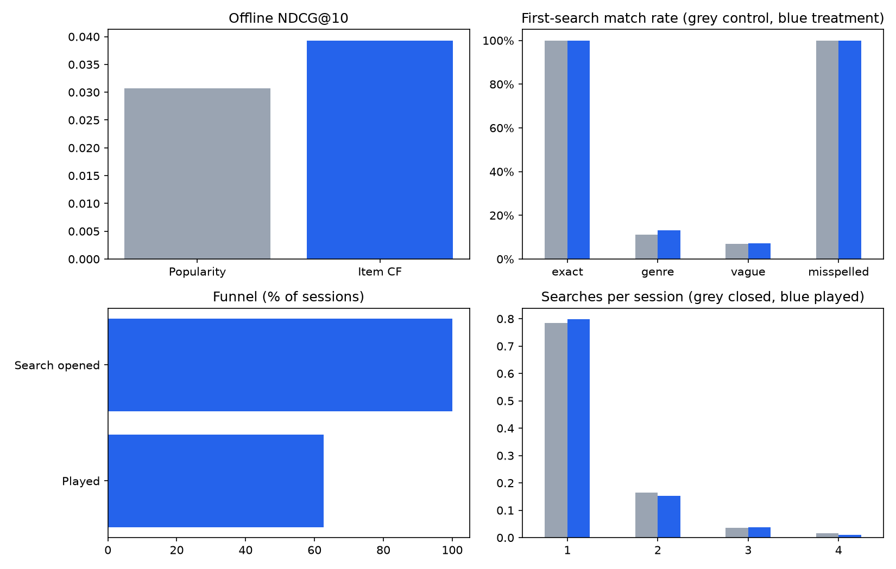

# Search Relevance Evaluation and A/B Test Simulation

Question: if search ranked results with item-based collaborative filtering instead of by popularity, would more sessions end in a play?

## Data
MovieTweetings (github.com/sidooms/MovieTweetings): 921,398 real movie ratings (0-10 scale). Analysis subset: the 3,000 most-rated movies and users with 20+ ratings, giving 8,140 users, 3,003 movies and 535,276 ratings. A rating of 8+ counts as relevant. Place ratings.dat and movies.dat in data/.

## Run
    pip install -r requirements.txt
    python search_relevance_ab.py data/

The data/ folder is not in this repo. Download ratings.dat and movies.dat from the `latest` folder of the MovieTweetings repo and put them in data/. The script writes results.json and dashboard.png.

## Method
1. Time-based split: each user's last 20% of ratings are the test set; ratings of 4 or 5 count as relevant.
2. Control = popularity ranker. Treatment = item-based CF (cosine similarity on the binary train matrix).
3. Offline metrics at K=10: Precision, NDCG, MRR, Hit rate.
4. Search sessions are SIMULATED (MovieLens has no search logs). Query mix: 45% exact title, 25% genre, 20% vague, 10% misspelled (fuzzy-matched with difflib). Title queries count as a match if the top-1 result is the target; genre and vague queries count if a relevant item is in the top 3.
5. Behaviour assumptions (editable in the script): click probability 85% if relevant result shown, else 30%; play after click 80%; up to 4 attempts; ~8 seconds per attempt.
6. A/B test: users randomised 50/50, sample ratio mismatch check (chi-square), two-proportion z-test on play conversion, 95% CI on the lift, power analysis for a 2-point lift.

## Results (real run)
Offline ranking at K=10 (8,140 users):

| Metric | Popularity | Item CF |
|---|---|---|
| Precision | 1.82% | 2.38% |
| NDCG | 0.0307 | 0.0393 (+28.1%) |
| MRR | 0.0538 | 0.0624 |
| Hit rate | 14.2% | 18.3% |

Simulated A/B test (20,000 sessions, 10,000 per arm):
- Sample ratio check passed (p = 1.00).
- Play conversion: control 62.78% vs treatment 62.59%, difference -0.19 points, z = -0.28, p = 0.78, 95% CI [-1.53, +1.15] points.
- First-search match rate by query type: genre 11.2% to 13.2%, vague 7.0% to 7.1%, exact and misspelled about 100% in both arms.
- Average 1.27 searches and 10.6 seconds per session.
- Sample needed to detect a 2-point lift at 80% power: about 9,171 per arm.

## Takeaway
A 28% offline NDCG gain did not turn into a measurable conversion gain. Only genre and vague queries (45% of sessions) depend on the ranker, and the lift on those was small, so the overall effect stayed within about +/-1.5 points. Recommendation: do not claim a conversion win; focus on vague and genre queries, where match rates are lowest, and re-test with a larger sample.

## Limits
Session behaviour and the click and play probabilities are assumptions, so the A/B lift demonstrates the method, not a production effect. The offline ranking metrics are measured on real ratings.